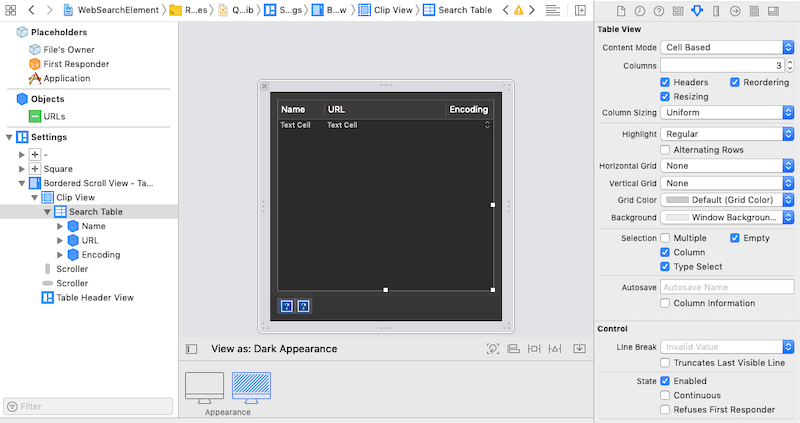

### Upgrading Nibs to Xibs and for Dark Mode

Follow these steps to upgrade old nibs to xibs, and fix issues with dark mode:

1. Open your project, then open the Nib. Click 'Open and Upgrade' if necessary:


2. If 'Open and Upgrade' fails with a similar error to that below, try:


a) upgrading manually using the terminal command ([reference](https://github.com/akahan/Nib-Decompiler/issues/5))

```
ibtool NIBNAME.nib --upgrade --write NIBNAME.xib
```

b) Delete the old .nib file from the XCode project, then re-add the xib:


3. Open up the Xib file, and for any views that are displaying incorrectly, edit the 'Background' and 'Grid Color' values from their custom values, to one of the system-provided colors. e.g.:
    * Background: Text Background Color or Window Background Color
    * Grid Color: Default (Grid Color)


4. You can check what the Nib would look like in dark mode by toggling the 'View as' option:


5. Afterwards, it should look something like this:



6. Resave and re-build :)